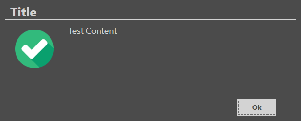
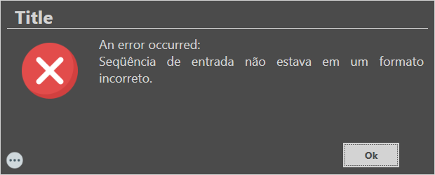
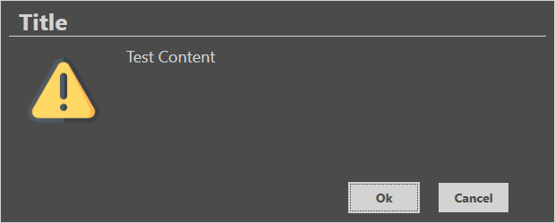
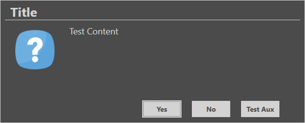

<div align="center">
  <h1>Pretty Message Box</h1>
</div>

[](https://www.nuget.org/packages/PrettyMessageBox)
[](https://www.nuget.org/packages/PrettyMessageBox)
[](./LICENSE.txt)

A pretty `MessageBox` to use in your WPF projects

## Samples

```cs
MessageBox.Show("Title", "Test Content", ImageOptions.Checked);
```


```cs
try
{
  ...something...
}
catch (Exception ex)
{
  MessageBox.Show("Title", "An error occurred:", ex);
}
```


```cs
MessageBox.Show("Title", "Test Content", ImageOptions.Info, ButtonOptions.OkCancel);
```


```cs
MessageBox.Show("Title", "Test Content", ImageOptions.Question, ButtonOptions.YesNoAuxiliary, "Test Aux");
```

